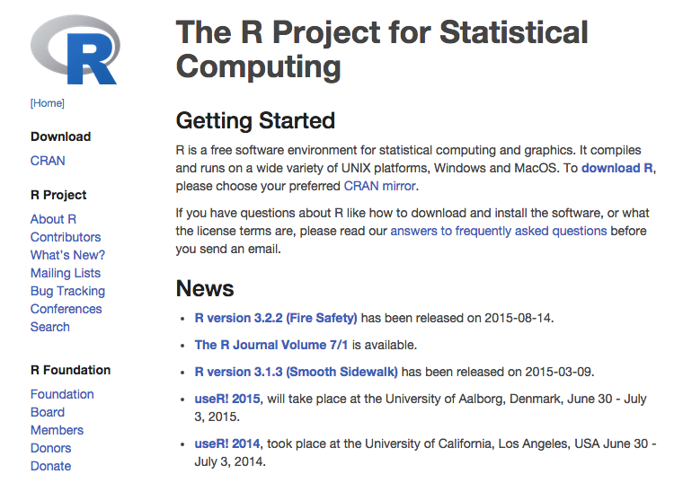
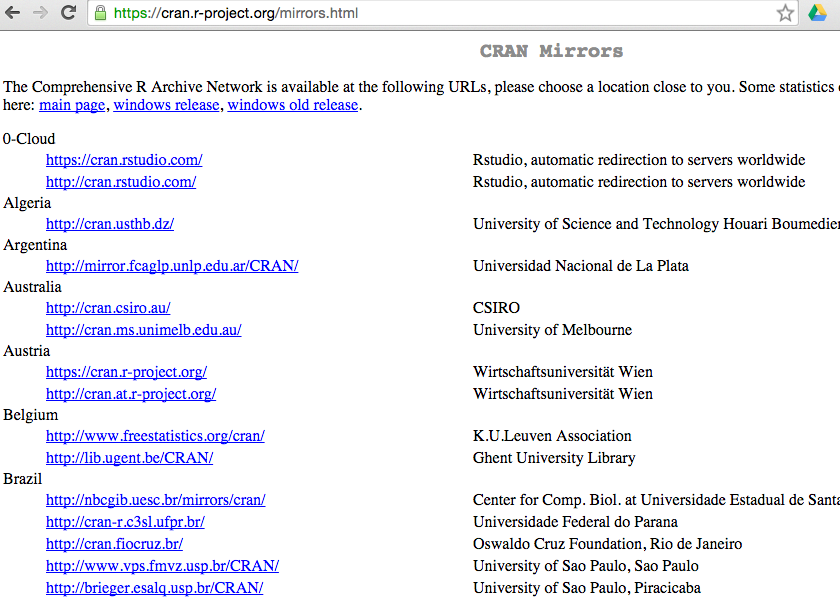
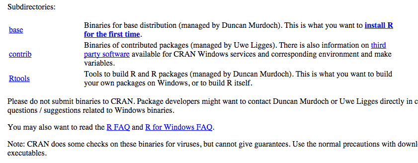
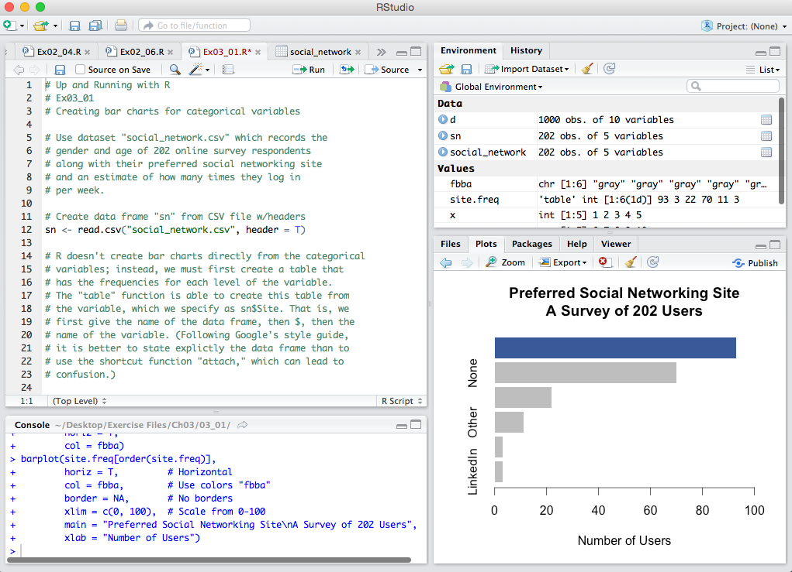
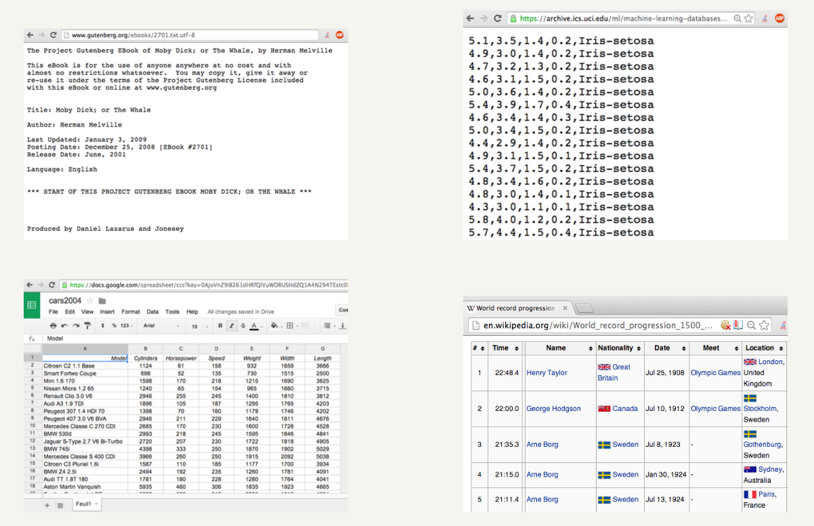

# Iniciando con R

- R es el más poderoso lenguaje de programación para estadistica numerica, fue desarrollado por un grupo de profesores para motivar a sus estudiantes a aprender estadística.

-  R es completamente gratuito y está disponible para Windows, Mac y Linux y la instalacion es sumamente simple.
- Unicamente es necesario ir a http://www.r-project.org una vez ahi seleccionar la opcion **CRAN** y elegir uno de los sitios de descarga para nuestro caso seleccionamos **0-cloud**.









## Versiones de R
- R se viene en tres diferentes versiones. Para nuestro caso instalaremos la version *base* desde la cual podremos instalar los paquetes adicionales de este curso. El tiempo de descarga varia de 5 a 10 min.

  - base   
  - contrib     
- R tools   


R es un lenguaje muy popular y esto ha permitido a desarrolladores crear Editores más simples de usar que simplifican algunas de las  tareas más comunes.
R Studio es un IDE para utilizar R se puede descargar directamente de http://www.rstudio.com.



## RStudio

Es un potente editor para trabajar con R, el cual nos permite acceder a la carpeta de trabajo, instalación de paquetes adicionales, y manejo de objetos en memoria.
De la misma manera que R cuenta con una terminal de comandos desde donde se accede al motor de R. De las principales ventajas de RStudio se encuentran:

* Manejo de versiones
* Manejo de gráficos en diversos formatos
* Manipulación de datos usando librerias
* Interacción con R desde paquetes como *R Commander* y *R Excel*
* Revolutions Analytics

# Primeros pasos con R

```{r}
2 + 2  # Matematica Básica; Mac: cmd-enter; PC: ctrl-r

1:100  # Imprimir los numeros de 1 al 100

print("Hello World!")  # Imprime "Hello World" en la pantalla

#' Creando Variables en R
x <- 1:5  # Asigna los numero del 1 al 5 a la variable x
x  # Muestra el valor de x
y <- c(6, 7, 8, 9, 10)  # Combina en una lista los numeros del 1 al 60 a y
y  # imprime y
x + y  # Suma el valor de los elementos de x a los elementos de y
x * 2  # Multiplica cada elemento en  x por 2


```
## Manejo de listas en R (subsetting)

### Uso de la funcion **c**
La función "c" concatena (agrupa, junta) elementos sueltos en un vector.
```{r}
v0 <- c(67,12,1,-99,0.44,333.22)
v1 <- c("chivas","tuzos","monarcas")
v2 <- c(TRUE,FALSE,TRUE)
```


- Los elementos son del mismo tipo en el caso de concatenar, no así en los dataset que pueden mezclar números,letras,booleanos.
- Para acceder a los elementos se utilizar los corchetes "[]"
```{r}
E <- v0[5]  # accedemos al elemento 5 de la lista v0
E       #imprimos el contenido de E
```


### Multiples selecciones 

#### Los dataFrame

- Sea una lista de músicos representada con sus años de nacimiento y el instrumento que interpretan.
```{r}

## Tipos DataFrame

df <- data.frame(
      name = c('John','Paul', 'George', 'Ringo'),
      birth = c(1940,1942,1943,1940),
      instrument = c("Guitar","Bass","guitar","drums")
      
        )

df # imprimimos el contenido de df
```

- Si deseamos acceder a más de un elemento de la lista usamos el índice del elemento.
```{r}

df [c(2,4),c(2,3)]
```
### Uso de $:$ en vectores
```{r}
#df[1:4]
df[c(1:4),2]
```

```{r}
df[-c(2:4),2:3]
```


## Siguiente: Manejo de Ficheros en R

- R tiene herramientas para importar diferentes tipos de archivos.
- Los más utiles para análisis son los archivos de _texto plano_   
- Los archivo de _texto plano_ son cualquier archivo que pueda ser legible por los humanos sin requerir de ningun programa (ejemplo: .txt, csv, .xml, html).
- Los archivos de texto son secuencias de caracteres.
- Cada caracter equivale a un solo byte de datos.
- Los archivos pueden ser manipulados con un editor de texto.



