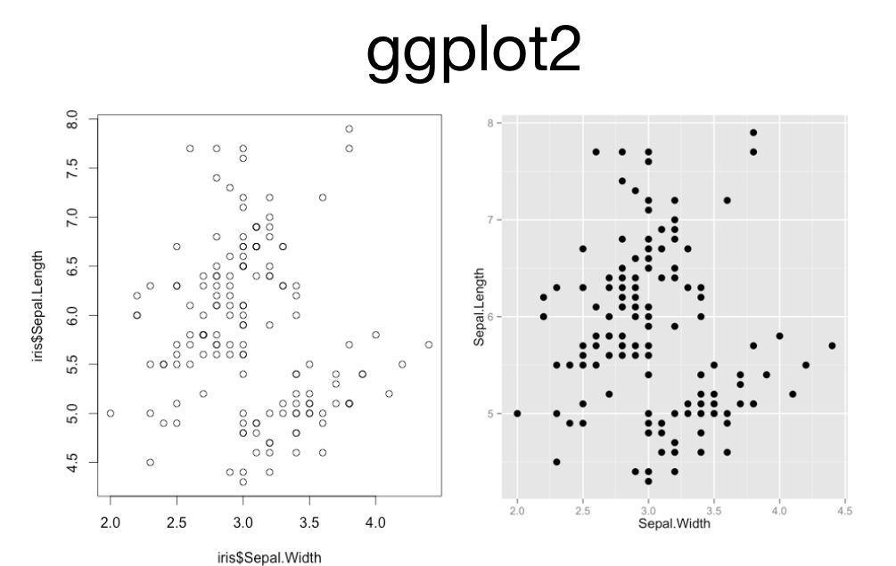
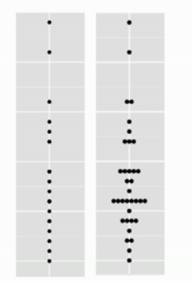
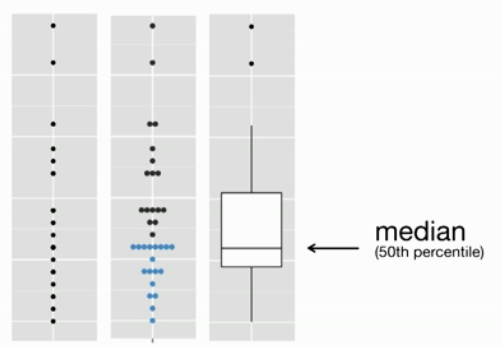
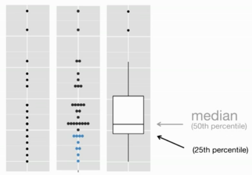
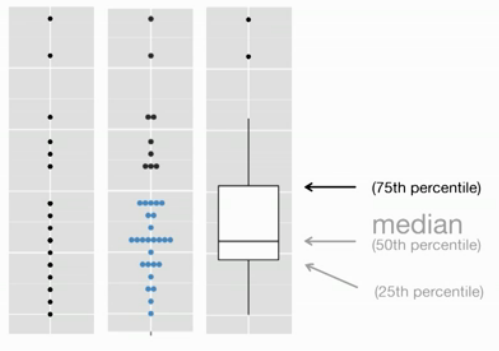
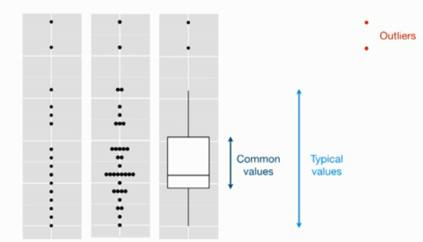

## Graficación en R ()

```{r eval=FALSE} 
plot(iris$Sepal.Width ,iris$Sepal.Length)
```


```{R}
library(ggplot2)
plot(iris$Sepal.Width,iris$Sepal.Length)

```

- Es el método más simple de R para graficación   
- Realiza diferentes acciones dependiendo del contexto   
- Es sumamente complicado personalizar   



## Visualizando Diferentes Conjuntos de Datos
```{r}
library(ggplot2)
#?mpg #ver la ayuda de un dataset
#View(mpg)
#qplot(disp,hwy, data=mpg)
#qplot(displ,hwy, data=mpg,color=class)
#qplot(displ,hwy, data=mpg,color=class,shape=trans)
```


# Utilizemos Facetting
```{r}

qplot(displ,hwy, data=mpg)+
  facet_grid(drv ~ cyl)
qplot(displ,hwy, data=mpg)+
  facet_grid(drv ~ .)
qplot(displ,hwy, data=mpg)+
  facet_grid(. ~ cyl)
qplot(displ,hwy, data=mpg)+
  facet_wrap( ~ class)
```

# Using Geom
- En ocasiones cuando tenemos una gráfica de puntos es complicado observar la tendencia de los datos, ocasionado por la cantidad de puntos, para ello podemos agregar una linea suavizada a la gráfica.
```{r , echo=FALSE}
set.seed(1410)
dsmall <- diamonds[sample(nrow(diamonds),100),]
```
```{r}
library(mgcv)
qplot(carat,price,data=dsmall, geom=c("point","smooth"), span=1, method = "gam", formula = y ~ s(x))
```

### Cajas

- Cuando un conjunto de datos contiene una variable categorica y una o más variables continuas, problemente sea más interesante conocer como los valores de la variable continua varia con los niveles de la variable categorica.

```{r}
qplot(color, price / carat, data = diamonds, geom = "boxplot")
```

```{r}

qplot(class,hwy,data=mpg,geom="boxplot")
qplot(reorder(class,hwy,FUN=median),hwy,data=mpg,geom="boxplot")
```






# Usando gráficos de Barras y Densidad

```{r}
qplot(carat,data=diamonds, geom="histogram")
qplot(carat,data=diamonds, geom="density" )
qplot(carat, data = diamonds, geom = "histogram", binwidth = 1,
  xlim = c(0,3))
qplot(carat, data = diamonds, geom = "histogram", binwidth = 0.1,
  xlim = c(0,3))
qplot(carat, data = diamonds, geom = "histogram", binwidth = 0.01,
  xlim = c(0,3))
```

## Creando Mapas con R
- Ejercicio usando el archivo texas.csv crear el gráfico usando los siguientes parametros
```
geom="polygon"
group = group
fill = group
```


```{r eval=FALSE }
texas <- read.csv("datos/texas.csv",header = TRUE)
tx <- qplot(long,lat,data=texas,geom="polygon",group=group,fill=group)
tx <- ggtitle("Poblacion de los condades de Texas")

```

